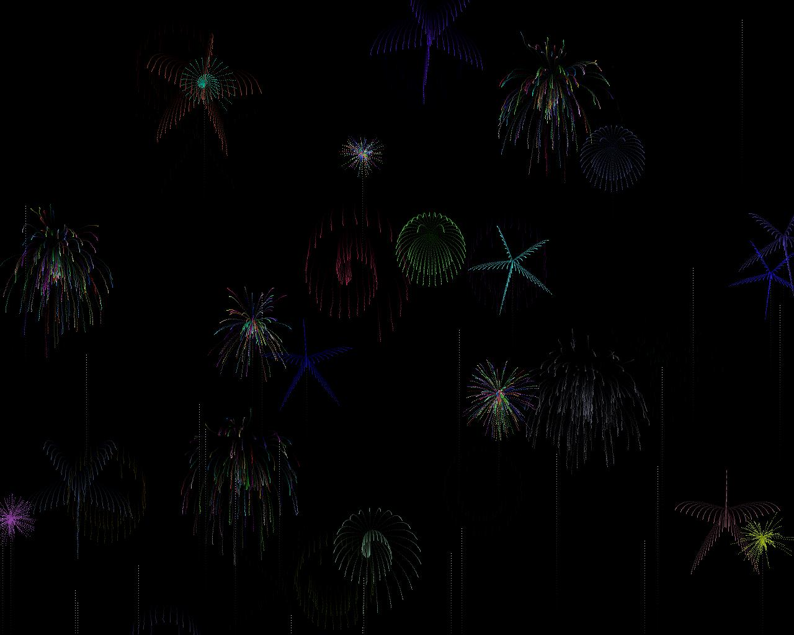



## Fireworks Screensaver

### Description

To see the fireworks display you can do 2 thigs:

1)Set the startup object under project properties to "SubMain" and compile the file as a .scr and place it in the windows folder, and then use it like a regular screen saver.

2)Set the startup object under project properties to "SubMain" and compile or just run it.

It runs much better when compiled.
 
### More Info
 

             |
---                |---
**Submitted On**   |2006-04-18 10:25:48
**By**             |[Jason R B](https://github.com/Planet-Source-Code/PSCIndex/blob/master/ByAuthor/jason-r-b.md)
**Level**          |Advanced
**User Rating**    |4.6 (23 globes from 5 users)
**Compatibility**  |VB 6\.0
**Category**       |[Graphics](https://github.com/Planet-Source-Code/PSCIndex/blob/master/ByCategory/graphics__1-46.md)
**World**          |[Visual Basic](https://github.com/Planet-Source-Code/PSCIndex/blob/master/ByWorld/visual-basic.md)
**Archive File**   |[Fireworks\_1988084182006\.zip](https://github.com/Planet-Source-Code/jason-r-b-fireworks-screensaver__1-65048/archive/master.zip)

